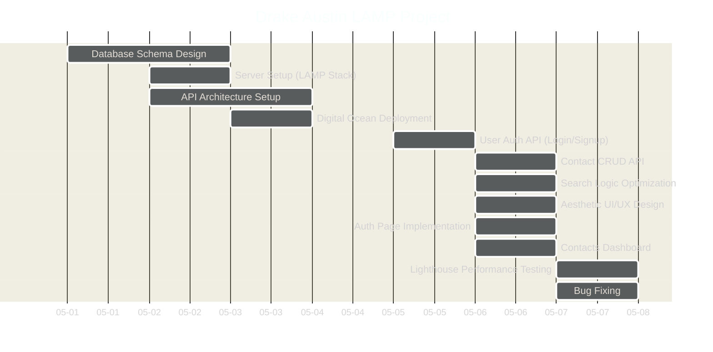

A comprehensive timeline of the project lifecycle.

```mermaid
%%{init: {'theme': 'dark'}}%%
gantt
    title Drake Austin LAMP Project
    dateFormat  YYYY-MM-DD
    axisFormat  %m-%d

    Database Schema Design        :da1, 2026-05-01, 2d
    
    Server Setup (LAMP Stack)     :des2, 2026-05-02, 1d
    API Architecture Setup        :des3, 2026-05-02, 2d
    Digital Ocean Deployment      :des4, after des2, 1d

    User Auth API (Login/Signup)  :api1, 2026-05-05, 1d
    Contact CRUD API              :api2, after api1, 1d
    Search Logic Optimization     :api3, after api1, 1d

    Aesthetic UI/UX Design        :ui1, 2026-05-06, 1d
    Auth Page Implementation      :ui2, 2026-05-06, 1d
    Contacts Dashboard            :ui3, 2026-05-06, 1d

    Lighthouse Performance Testing :qa2, after ui1, 1d
    Bug Fixing                    :qa3, after ui1, 1d

```
